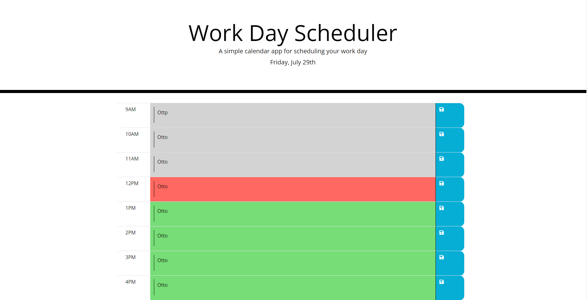

# Hourly-Workday-Scheduler

Creating a daily schedule to keep track of things to do every hour

## Acceptance Criteria

* current day displayed at the top of the screen in heading

* timeblocks for standard business hours

* timeblocks colorcoded based on relation to the present time of day

* ability to enter information into the timeblocks

* upon clicking the save button, data in the event is saved locally

* page loads with all saved data in their timeslots

## Website

https://northernpines.github.io/Hourly-Workday-Scheduler/

